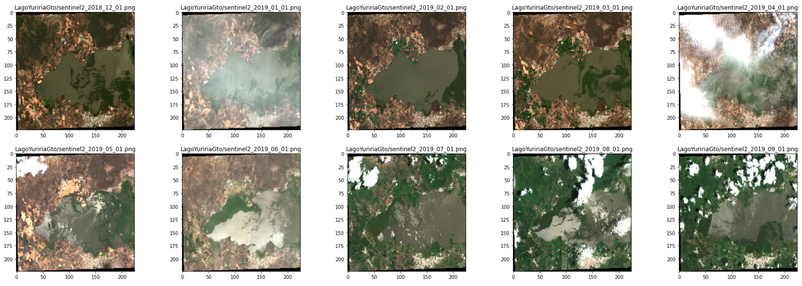

# Drought prediction with satellite images  

Este repositorio viene como resultado del Cyber Hackathon AiLab School 2021.  
https://github.com/HackifyMX/CyberEquipo20  

A continuación se presentarán los resultados del Equipo 20, ganadores del segundo lugar del reto Aeropespacial.  

# Equipo 20: Pista Latente ML

**Integrantes del equipo:**   
1.- Andrea Berenice Ek Hobak    
2.- Gabriela Marali Mundo Cortés   
3.- Mario Xavier Canche Uc  
4.- Myrna Citlali Castillo Silva  

# Sistema de Identificación y predicción de sequía en México  
El cambio climático y el calentamiento global son unos de los grandes problemas de nuestro tiempo, sus consecuencias ya nos han alcanzado y en muchos lugares se comienzan a sufrir gravemente de muchos de sus problemas. Uno de ellos es la sequía, que impacta de forma crucial a sectores como la agricultura, la ganadería e incluso el abastecimiento de agua en ciertos lugares. Cada año los períodos de sequías son más largos y se comienzan a presentar en períodos atípicos nunca antes pensados. 

Como parte del Challenge Abierto Aeroespacial del Cyber AI Hackathon 2021, nuestro equipo propone un sistema para identificar y predecir sequías en México, basado en imágenes satélitales del Sentinel 2. Incluso se hace un análisis del comportamiento de la sequía en los últimos años para concientizar como nos ha afectado.
Para esto se desarrollo un algoritmo que pudiera extraer imágenes satélitales de una región de interés y en un cierto período de tiempo. Con esta base de datos se desarrollarón dos algoritmos de inteligencia artificial paralelos, ambos de aprendizaje no supervisado y que pueden ser aplicados a cualquier conjunto de datos de imágenes satelitales que contengan fuentes de agua importantes, como lagos, lagunas y presas.

El primer algoritmo de inteligencia artificial desarrollado, clasifica imágenes satelitales en "región con sequía" y "región sin sequía". Para esto el algoritmo de aprendizaje profundo extrae la información de la cantidad de vegetación en la imágen, la cantidad de agua en el lago, laguna o presa, y el número de nubes en la región. Con esta información extraída se aplica un algoritmo de aprendizaje no supervisado para identificar las imágenes con sequía y las que no.

El segundo algoritmo de inteligencia artificial desarrollado, utiliza algoritmos de visión computacional y aprendizaje no supervisado para segmentar las fuentes de agua en la imagen y aplicar una métrica para entender como la sequía ha impactado en ese instante del tiempo. A partir de eso, se desarollarón modelos estadísticos para predecir el impacto de la sequía en los próximos meses.

Creemos que es un buen inicio para entender el impacto de la sequía en México y con potencial para ser escalable y robusto.  
A continuación se describirá cada etapa del desarrollo.

## Etapas del desarrollo:

### Algoritmo para decargar imágenes satélitales en diferentes instantes del tiempo

Como primera etapa se desarrollo un algoritmo para decargar imágenes satélitales de una región de intéres y en diferentes instantes de tiempo. Para esto se utilizó la librería **ee** de Python, el cual es una API de [Google Earth Engine](https://earthengine.google.com/) que incluye más de cuarenta años de imágenes históricas y [conjuntos de datos científicos](https://developers.google.com/earth-engine/datasets/), que se actualizan y amplían diariamente.   

Para instalar la librería es suficiente con hacer:   
```
pip install earthengine-api
```

Entender como funciona la librería es un poco complicado, por lo mismo se desarrollo un par de funciones que simplificarán esta tarea y que lo único que necesitará fueran las [coordenadas](https://code.earthengine.google.com/?scriptPath=Examples%3ADatasets%2FCOPERNICUS_S2_SR) de la región de interés a analizar:   
```
geometry = ee.Geometry.MultiPolygon( # Lago  de Yuriria, Gto
          [[-101.22673270889172, 20.310577751754582],
           [-101.22673270889172, 20.206222227408922],
           [-101.04082343765148, 20.206222227408922],
           [-101.04082343765148, 20.310577751754582]], None, False)
```

El satélite que seleccionamos para decargar las imágenes fue el [Sentinel 2](https://developers.google.com/earth-engine/datasets/catalog/COPERNICUS_S2_SR):
```
IMGSentinel = ee.ImageCollection ('COPERNICUS/S2_SR').filterDate(start_date, end_date).filterBounds(geometry).filterMetadata ('CLOUDY_PIXEL_PERCENTAGE', 'Less_Than', 30)
```

En el notebook [**Descarga_ImagenSatelital.ipynb**](https://github.com/HackifyMX/CyberEquipo20/blob/main/Descarga_ImagenSatelital.ipynb) se pueden encontrar las funciones que facilitan esta tarea y que ya están preparados para guardar el conjunto de imágenes descargadas en carpetas específicas. 

### Detección de sequía mediante clusterización de imágenes satelitales

En esta parte del algoritmo, desarrollamos un [modelo de aprendizaje no-supervisado](https://github.com/HackifyMX/CyberEquipo20/blob/main/features_and_clasification.ipynb), capaz de indicar cuales imágenes satelitales se relacionan al fenomeno de sequía. Inicialmente, probamos la extracción de características mediante la red pre-entrenada VGG19. Como sabemos, el modelo VGG19 es una red neuronal convolucional, que como su nombre lo indica, tiene un total de 19 capas. La red VGG19 toma como entrada una imagen RGB y devuelve una representación de esta imagen de tamaño *7x7x512*. Una vez que se obtiene el tensor de características para un conjunto de datos, se emplea un algoritmo de clusterización jerárquica para clasificar los datos en dos clases: *sequía* y *no sequía*.


**Dataset**   
Las base de consta de series de imágenes satelitales adquiridas para algunos cuerpos de agua ubicados en México. Para mostrar el funcionamiento del clasificador, empleamos imágenes correspondientes al lago Yuriria en Guanajuato. En esta serie de imágenes se puede observar como para distintos instantes, algunas características como el color, cambian cuando el área del cuerpo de agua disminuye. En seguida, se muestran algunas imágenes de esta serie.   



**Extracción de características con VGG19**   
Como se menciona anteriormente, se emplea la red pre-entrenada VGG19 para extracción de características. La base de datos, con la cual se entrenó este modelo, es nombrada ImageNet. Como paso previo a la extracción de características, se realiza un pre-procesamiento de las imágenes, ya que el entrenamiento se llevó a cabo sobre imágenes BGR normalizadas.   

**Clusterización**   
Finalmente, se emplea un algoritmo de cluzterización jerárquica que utiliza la distancia euclidiana como métrica. Se espera que las imágenes donde se observa un grado de sequía, sean agrupadas en una clase.    


**Resultados**    
En la figura de abajo, se muestran los resultados obtenidos. Se observa que las imágenes donde la vegetación disminuye, son agrupadas. Así mismo, se puede notar que la clasificación es correcta aunque las imágenes contengan elementos como, nubes o niebla. Por otro lado, analizando el denograma, se puede advertir como, algunas características permiten asociar datos que pertenecen a la misma clase. Por ejemplo, algunas imágenes en sequía, comparten la característica de la niebla y aparecen como un grupo dentro la clase.   


### Segmentación de cuerpos de agua en imágenes satélitales  
En el script  SegmentaAguaConClustering.ipynb, se propone un método
de segmentación de cuerpos de agua, el cual es un método no supervisado.
Recibe como entrada imágenes del satélite Sentinel-2, el cual es una misión de imágenes 
multiespectrales de alta resolución y amplia franja que respalda los estudios de monitoreo
terrestre de Copernicus, incluido el monitoreo de la vegetación, el suelo y la cubierta de agua,
así como la observación de vías navegables interiores y áreas costeras.
Para nuestro estudio, trabajamos con las imágenes que proporciona la banda 11 Sentinel-2
los cuales tienen una longitud de onda de 1613.7nm (S2A) / 1610.4nm (S2B).

A continuación se describe brevemente los pasos de la segmentación de cuerpos de agua:  
**Paso1:** Obtención de imágenes de ciertas regiones donde se sabe que hay cuerpos de agua, 
en distintas bandas del satélite Sentinel-2.


Se analizaron las imágenes de las distintas bandas y nos quedamos con la banda 11
ya que fue la que arrojo mejores resultados.

**Paso2:** Se uso la imagen en escala de grises, donde a cada uno de los pixeles de la imagen se le puede
ver como un elemento independiente con característica,la intensidad de la banda. Así que al vector
de las intensidades (vector de características) se le aplica una normalización y PCA, posteriormente
aplicamos un método de clustering (KMEANS) para segmentar la imagen en dos clases: suelo y agua


**Paso3:** Después de tener la imagen binarizada, lo que hacemos es quedarnos con la estructura
de mayor tamaño, esto para descartar ruido.


**Paso4:** Posteriormente de que obtenemos la estructura con mayor area, rellenamos los orifcios 
que se tienen dentro de la estructura.


Para mayor información consultar el notebook [**SegmentaAguaConClustering.ipynb**](https://github.com/HackifyMX/CyberEquipo20/blob/main/SegmentaAguaConClustering.ipynb).

### Aplicación

Uno de los objetivos o propuestas de aplicación durante este proyecto fue tratar de 'medir' el área de los cuerpos de agua observados en las imágenes para poder obtener una 'tasa de sequia', para esto, una vez manipuladas las imágenes se obtuvo la cantidad de pixeles en donde se distingue un cuerpo de agua y sobre esas cantidades se crearon gráficos que nos ayudaran a observar las temporadas de sequía durante los años. Inicialmente se trató de trabajar con series temporales para poder obtener también una predicción de la sequía en la zona, sin embargo las imágenes que se pudieron descargar para la creación de la base de datos no permitió la culminación de este objetivo ya que no se lograron obtener imágenes para fechas específicas que permitieran tener un rango de tiempo igual entre cada imágen, aún imputando datos sobre las fechas faltantes. Por lo tanto solo se pudo obtener una tasa de sequía y conocer las temporadas donde ésta está más presente a través de los años. 
Se analizaron los siguientes cuerpos de agua:
- Presa 'La Purísima' en Guanajuato
- Lago 'Yuriria' en Guanajuato
- Lago de Chapala en Jalisco
- Lago de Janitzio en Michoacán
- Laguna de Catemáco en Veracruz

Se muestra el ejemplo de la aplicación para la presa 'La purísima'


Imagen de presa la Purísima tomada el 22 de agosto de 2020

Imagen de presa la Purísima tomada el 03 de julio de 2020


Se puede visualizar que los puntos donde se registra mayor sequía en la Presa 'La Purísima' se dan en los meses de  julio y septiembre, y los de menor sequía en abril, mayo y agosto

Para mayor información consultar el notebook [**Análisis de sequía.ipynb**](https://github.com/HackifyMX/CyberEquipo20/blob/main/Analisis_sequia.ipynb).
